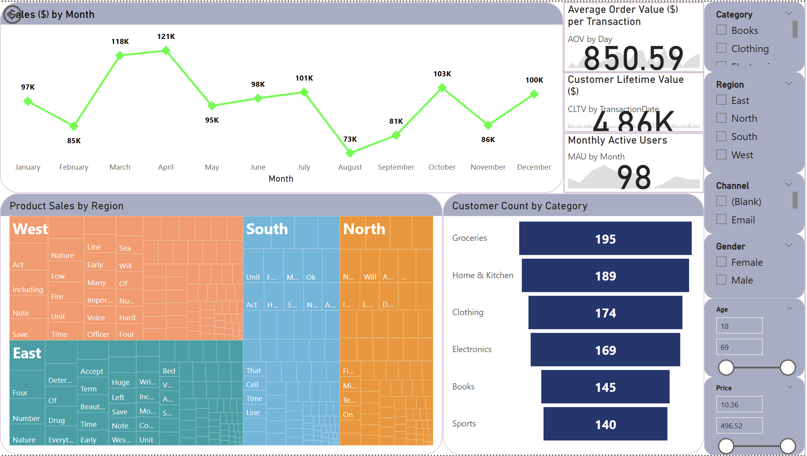

# 📊 Capstone 2 – Customer Retention & Sales Analysis



An **end-to-end retail analytics project** integrating **SQL, R, and Power BI** to deliver **customer segmentation, statistical insights, and interactive visualizations**.  
Developed as part of the Certified Data Analysts program, this project extends Capstone 1’s work by applying **machine learning clustering, hypothesis testing, and dynamic dashboards**.

---

## 📜 Project Description
This repository contains **Capstone Project 2** for the Certified Data Analysts program, focusing on **customer retention and sales optimization**.  
The workflow includes:

1. **Data Preparation** – Cleaning and integrating transaction data from CSV files using SQL.
2. **Statistical Analysis** – Applying **Chi-squared** and **ANOVA** tests in R to understand relationships between variables.
3. **Customer Segmentation** – Performing **K-means clustering** (Recency, Frequency, Monetary, Age) to group customers by purchasing behavior.
4. **Data Visualization** – Creating interactive dashboards in **Power BI** for executive decision-making.

---

## 📂 Repository Structure

```
capstone2-customer-retention-sales/
├─ data/ # Raw datasets
│ └─ Complete.csv
├─ sql/ # SQL scripts
│ └─ 01_transactions_data_join.sql
├─ r/ # R scripts
│ ├─ 01_chi_squared_anova_analysis.R
│ ├─ 02_kmeans_customer_segmentation.R
│ └─ 03_visualization_charts.R
├─ bi/ # Power BI dashboards
│ └─ CDA - Nazreen Agos Capstone Project.pbix
├─ reports/ # PDF reports
│ ├─ Certified-Data-Analysts-Capstone-Project-Part-2.pdf
│ └─ CDA - Capstone2 (Nazreen Agos).pdf
├─ images/ # Dashboard screenshots
│ └─ dashboard.png
```

---

## 🗄 Data Sources
- **Complete.csv** – Combined dataset containing transactions, customers, and product details.
- Data prepared in SQL before exporting to R and Power BI.

---

## 📊 Key Analyses
**1. SQL Data Integration**  
File: `sql/01_transactions_data_join.sql`  
- Joins multiple tables into a clean, analysis-ready dataset.

**2. Hypothesis Testing in R**  
File: `r/01_chi_squared_anova_analysis.R`  
- Chi-squared tests for categorical variable relationships.  
- ANOVA tests for mean differences across groups.

**3. K-means Clustering in R**  
File: `r/02_kmeans_customer_segmentation.R`  
- Segments customers into 3 groups using RFM + Age.  
- Saves clusters as CSV and plots to PNG.

**4. Visualization in R & Power BI**  
File: `r/03_visualization_charts.R` and `bi/CDA - Nazreen Agos Capstone Project.pbix`  
- R generates key plots.  
- Power BI dashboard provides interactive KPIs, charts, and filters.

---

## ▶️ How to Run
**SQL:**  
Run `sql/01_transactions_data_join.sql` in your SQL environment to prepare the dataset.

**R scripts:**  
```bash
Rscript r/01_chi_squared_anova_analysis.R
Rscript r/02_kmeans_customer_segmentation.R
Rscript r/03_visualization_charts.R
```

**Power BI:**  
Open `bi/CDA - Nazreen Agos Capstone Project.pbix` in Power BI Desktop.

---

## 📈 Dashboard Features
- **KPI cards** for total revenue, retention rate, and top products.  
- **Customer segmentation** view by cluster.  
- **Interactive slicers** for filtering by region, product category, or campaign.  
- **Trend charts** for monthly sales and retention rates.  

---

## 🛠 Tools & Technologies
- **SQL** – MySQL for data integration and cleaning.  
- **R** – Statistical analysis & clustering.  
- **Power BI** – Interactive dashboards.  
- **GitHub** – Version control and project documentation.  

Author: Nazreen Agos
